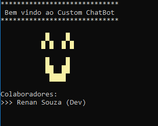
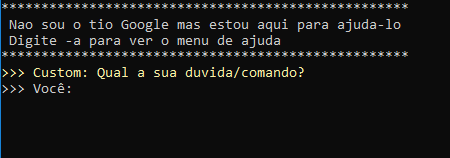
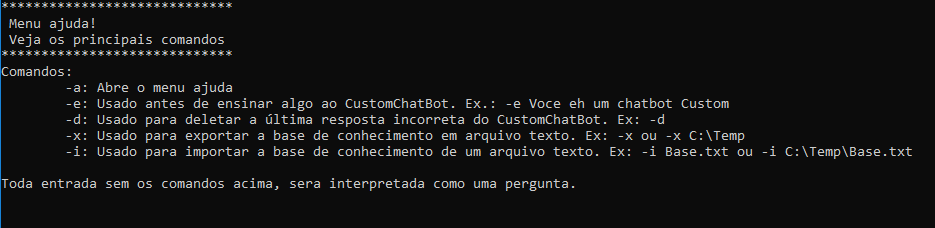
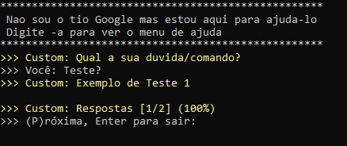
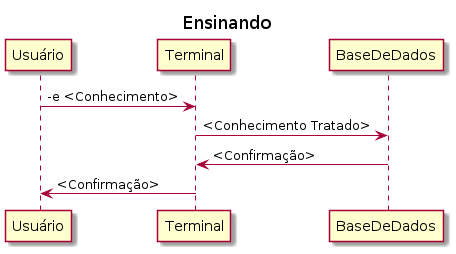
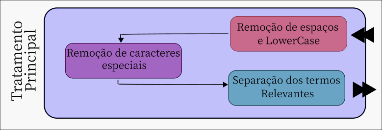

# TerminalChatBot
Um chatbot de terminal que funciona como uma base de conhecimento pessoal (não utiliza IA) criada como uma aplicação console C#.

A aplicação Console foi desenvolvida com .Net Core e SQLite.

O projeto não utiliza inteligência artificil, então para determinar a melhor resposta foi utilizada uma lógica baseada em termos relevantes.

O projeto foi feito para fins de aprendizado e não possui grandes pretensões, além da possibilidade de auxiliar todos que desejam agrupar de maneira simples e rápida as informações relevantes em um único lugar.

# Images

### Tela de Apresentação

### Tela Inicial

### Tela de Ajuda

### Exemplo de Retorno do ChatBot

### Fluxo da aplicação

### Tratamento de termos relavantes

